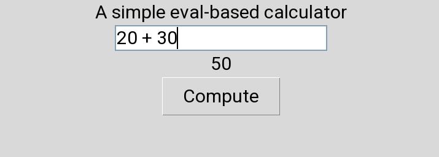

# 🧮 Simple-Python-Calculation

---

⚙️ What It Can Do

- Accepts user input (e.g., "1+2", "5*6", "10/2")
- Evaluates mathematical expressions
- Displays the result instantly when the Compute button is clicked
- Provides a simple graphical user interface (GUI)

---

🧠 How It Works

- The app uses Tkinter to create a window with:
  - A text input field ("Entry")
  - A button ("Compute")
  - A label to display results
  - When the button is clicked:
  - The input is retrieved from the text field
  - The "eval()" function processes the expression
  - The result is displayed on the screen

---

▶️ How to Run

1. Make sure Python is installed
2. Save the file as "calculator.py"
3. Run the file:
   python calculator.py

📚 What I Learned

- Creating GUI apps with Tkinter
- Handling user input in Python
- Using functions and event handling
- Understanding how "eval()" works

## 📌 Output
 
